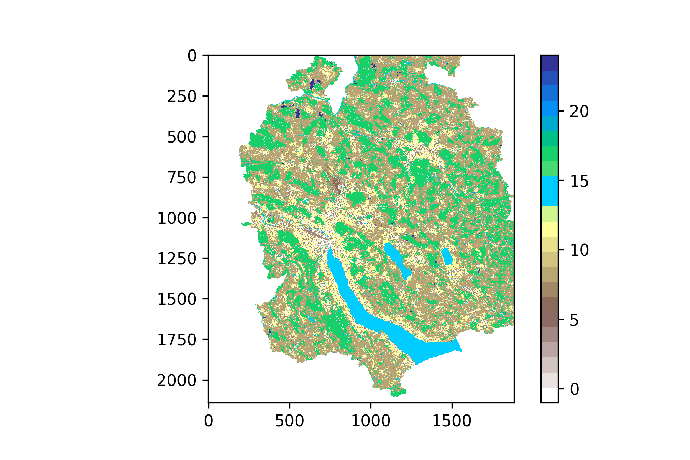
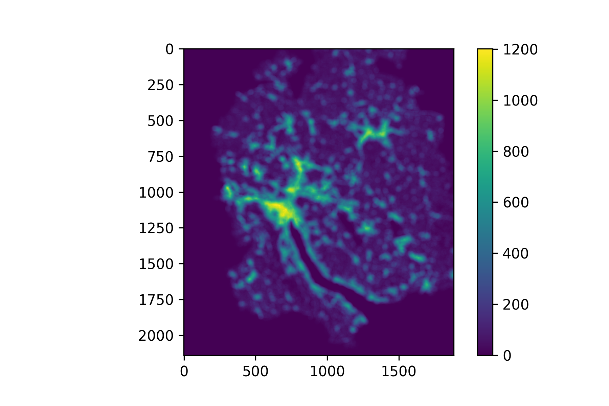

[](https://pypi.python.org/pypi/urban-footprinter/)
[](https://travis-ci.org/martibosch/urban-footprinter)
[](https://coveralls.io/github/martibosch/urban-footprinter?branch=master)
[](https://github.com/martibosch/urban-footprinter/blob/master/LICENSE)
[](https://mybinder.org/v2/gh/martibosch/urban-footprinter/master?filepath=notebooks/overview.ipynb)

Urban footprinter
===============================

A convolution-based approach to detect urban extents from raster datasets.

LULC | Convolution result | Computed urban extent
:-------------------------:|:-------------------------:|:-------------------------:
 |  | 

The approach is built upon the methods used in the [Atlas of Urban Expansion](http://atlasofurbanexpansion.org/). The main idea is that a pixel is considered part of the urban extent depending on the proportion of built-up pixels that surround it. See the [notebook overview](https://github.com/martibosch/urban-footprinter/tree/master/notebooks/overview.ipynb) or [this blog post](https://martibosch.github.io/urban-footprinter/) for a more detailed description of the procedure.


Installation and usage
----------------------

To install use pip:

    $ pip install urban-footprinter


Or clone the repo:

    $ git clone https://github.com/martibosch/urban-footprinter.git
    $ python setup.py install

Then use it as:

```python
import urban_footprinter as ufp

# Or use `ufp.urban_footprint_mask_shp` to obtain the urban extent as a 
# shapely geometry
urban_mask = ufp.urban_footprint_mask("path/to/raster.tif",
                                      kernel_radius,
                                      urban_threshold,
                                      urban_classes=urban_classes)
```

where 


    help(ufp.urban_footprint_mask)

    Help on function urban_footprint_mask in module urban_footprinter:
    
    urban_footprint_mask(raster, kernel_radius, urban_threshold, urban_classes=None, largest_patch_only=True, buffer_dist=None, res=None)
        Computes a boolean mask of the urban footprint of a given raster.
        
        Parameters
        ----------
        raster : ndarray or str, file object or pathlib.Path object
            Land use/land cover (LULC) raster. If passing a ndarray (instead of the
            path to a geotiff), the resolution (in meters) must be passed to the
            `res` keyword argument.
        kernel_radius : numeric
            The radius (in meters) of the circular kernel used in the convolution.
        urban_threshold : float from 0 to 1
            Proportion of neighboring (within the kernel) urban pixels after which
            a given pixel is considered urban.
        urban_classes : int or list-like, optional
            Code or codes of the LULC classes that must be considered urban. Not
            needed if `raster` is already a boolean array of urban/non-urban LULC
            classes.
        largest_patch_only : boolean, default True
            Whether the returned urban/non-urban mask should feature only the
            largest urban patch.
        buffer_dist : numeric, optional
            Distance to be buffered around the urban/non-urban mask. If no value is
            provided, no buffer is applied.
        res : numeric, optional
            Resolution of the `raster` (assumes square pixels). Ignored if `raster`
            is a path to a geotiff.
        
        Returns
        -------
        urban_mask : ndarray
