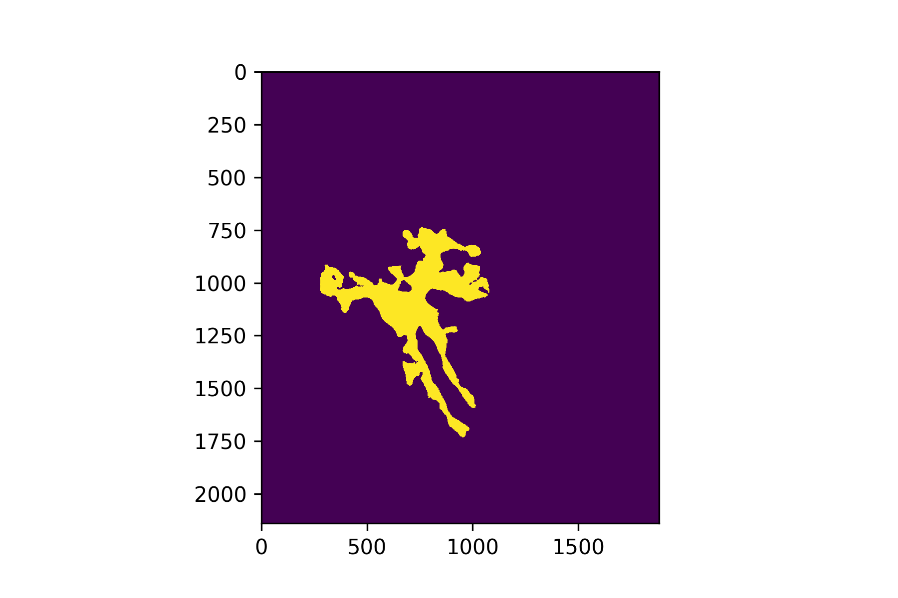

Urban footprinter
===============================

Overview
--------

A convolution-based approach to detect urban extents from raster datasets.

LULC | Convolution result | Computed urban extent
:-------------------------:|:-------------------------:|:-------------------------:
 |  | 

See the [notebook overview](https://github.com/martibosch/urban-footprinter/tree/master/notebooks/overview.ipynb) for more details on the procedure.

Installation
------------

To install use pip:

    $ pip install urban-footprinter

Or clone the repo:

    $ git clone https://github.com/martibosch/urban-footprinter.git
    $ python setup.py install
